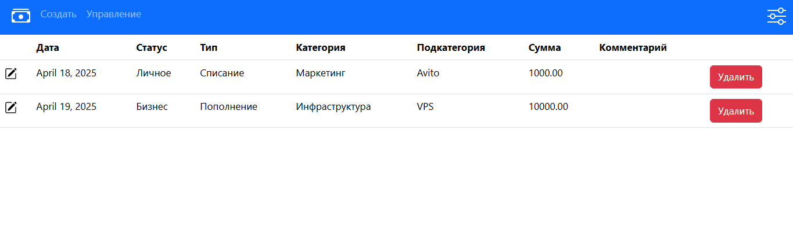
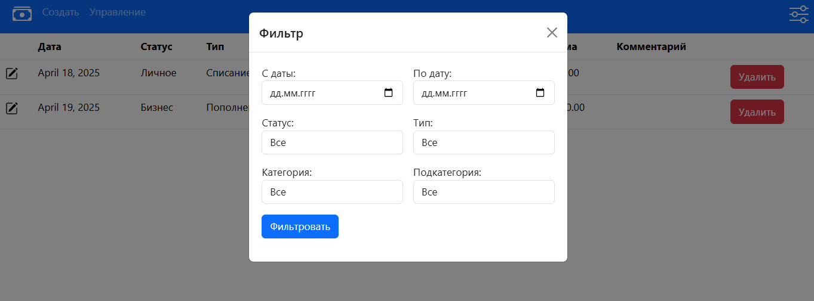
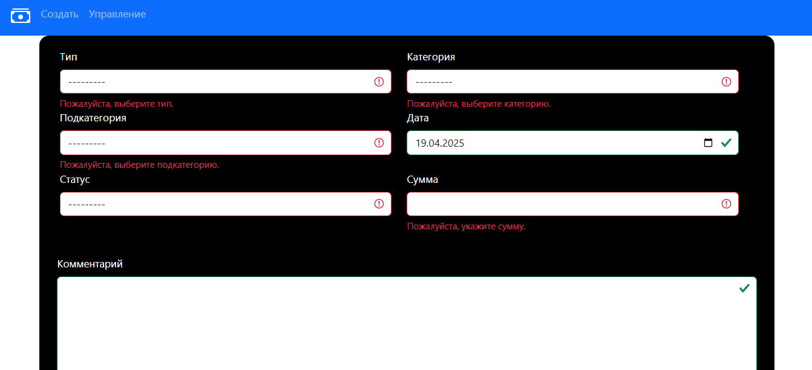
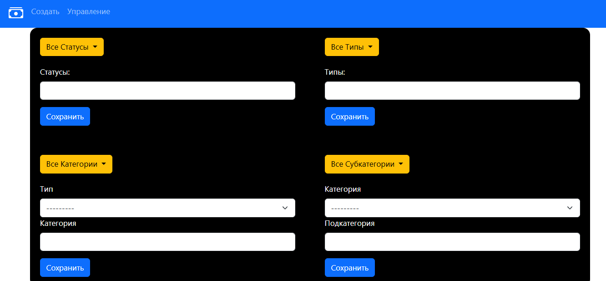
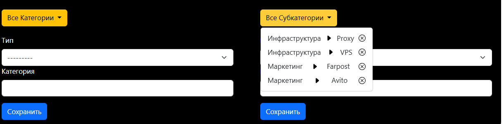

  

# Движение денежных средств

## Описание
Этот проект представляет собой веб-приложение для учета движения денежных средств (ДДС). Приложение позволяет пользователям создавать, редактировать, удалять и просматривать записи о движении денежных средств, а также управлять справочниками (статусы, типы, категории и подкатегории).
  

## Технологии

- Django 4.x

- Python 3.10+

- Bootstrap 5

- HTML5, CSS3

- JavaScript (динамическая фильтрация)

  

## Структура проекта

**`money/`** – основное приложение проекта

- `models.py` – модели (Тип, Категория, Подкатегория, Статус, ДДС)

- `forms.py` – Django-формы

- `views.py` – обработка логики

- `templates/money/` – шаблоны

- `static/money/` – стили, js файлы для диннамической фильтрации и удаления элементов

- `urls.py` – маршруты

  
## Шаги для установки и запуска

### 1. Клонировать репозиторий

Сначала клонируйте репозиторий проекта с GitHub на ваш локальный компьютер:


`git clone https://github.com/your-username/cash-flow-management.git` 


### 2. Настройка базы данных

Для простоты используется база данных SQLite, которая будет настроена автоматически. 

### 3. Применить миграции

После установки зависимостей необходимо применить миграции базы данных:

```
python manage.py makemigrations
python manage.py migrate
``` 

Эта команда создаст все необходимые таблицы в базе данных.


### 4. Запуск сервера

Запустите сервер разработки:

`python manage.py runserver` 

Сервер будет доступен по адресу [http://127.0.0.1:8000/](http://127.0.0.1:8000/).

### 5. Взаимодействие с веб-приложением

- #### `Главная страница`



Главная страница позволяет удалять и редактировать(иконка слева) записи




Правая иконка сверху позволяет отобразить форму для фильтрации записей


- #### `Сраница создания`



Страниц для создания записей, имеет валидацию на стороне клиента и на стороне сервера

- #### `Сраница управления`



Страница управления позволяет добавлять (Статусы, Тип, Категории и Подкатегории) и создавать зависимости между ними



Желтая кнопка позволяет увидеть все созданные элементы со всеми их зависимостями, кнопка X позволяет удалить элемент.

- #### `Шапка сайта`


Ссылки по страницам, иконка денег это ссылка на главную страницу ( таблица со всеми записями)


### 6. Заключение

Теперь вы можете использовать веб-приложение для учета движения денежных средств. Если возникнут вопросы или проблемы при установке или настройке, не стесняйтесь обратиться за помощью.


